# cellSight

cellSight is an R package for automated single-cell RNA sequencing (scRNA-seq) data analysis. It streamlines the process for both beginners and experienced bioinformaticians, requiring only data files.

* **Citation:** if you use the cellSight software, please cite: Ranojoy Chatterjee, Chiraag Gohel, Brett Shook, and Ali Rahnavard (2023+). **cellSight: Deciphering underlying dynamics of cells and gene expression.** R package version 0.0.1. https://www.rahnavard.org/cellSight.
[](https://zenodo.org/doi/10.5281/zenodo.10041146)

## Table of Contents

- [Installation](#installation)
- [Usage](#usage)
- [Funtions](#functions)
- [Example](#example)
  * [Studying the dynamics of cells and gene expression during injury-induced skin regeneration](#injury)
  * [Fibroblasts priming in aging](#aging)
- [Contributing](#contributing)

## Installation
Install Bioconductor packages before installing cellSight on the R console:
```R
# Install Bioconductor Manager and required packages
if (!require("BiocManager", quietly = TRUE))
    install.packages("BiocManager")

BiocManager::install(c("DelayedMatrixStats", "glmGamPoi", "metap", "multtest"))

```

To install cellSight using devtools:

```R
# Install devtools if you haven't already
if (!requireNamespace("devtools", quietly = TRUE)) {
  install.packages("devtools")
}

# Install cellSight from GitHub
devtools::install_github("omicsEye/cellSight")
```

## Usage
Single-cell analysis has emerged as a powerful tool in biology, enabling researchers to dissect cellular heterogeneity and better understand complex biological systems at unprecedented resolution. However, downstream single-cell data analysis is riddled with challenges and intricacies that must be carefully addressed to derive meaningful insights. Streamlining and having a well-detailed pipeline mitigates the issues mentioned above related to scRNA data and also, in turn, creates a generalized platform that eases the overhead associated with single-cell downstream analyses. Thus, we created a software cellSight that automates a series of downstream QC and normalization processes along with tools required for differential analysis and cell communication under its banner.
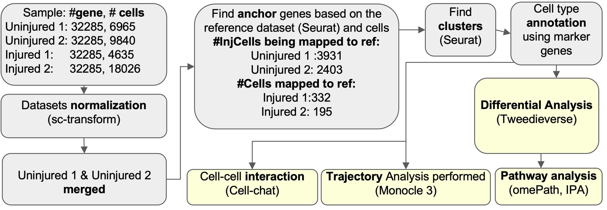
The pipeline for “cellSight” accepts the snRNA data as input and carries out standard quality control and normalization on the data. cellSight then performs data merging based on anchor genes and uses the merged data to run differential expression using Tweedieverse, cell communication using CellChat, and pathway enrichment analysis using omePath.

For cellSight, ensure your transcriptomics data is in the format:

Single dataset: <br>"path/to/data/outs/filtered_feature_bc_matrix/sample"

Multiple datasets:<br>"path/to/data/outs/filtered_feature_bc_matrix/sample1",<br>                         "path/to/data/outs/filtered_feature_bc_matrix/sample2",
<br>
                  "path/to/data/outs/filtered_feature_bc_matrix/sample3"

```R
# Load the cellSight package from the github repo
library(cellSight)

# Provide your data files (e.g., expression matrix )

# Run cellSight
cellSight("path/to/data", "path/to/output")

# To use the sample datafiles available with the package, please download the "datafiles" folder available in the cellSight replo and provide the path for the downloaded datafiles and your desired output file locations repectively:
Example - cellSight("C:/Users/Desktop/cellSight/datafiles/","C:/Users/Desktop/test")

```

## Functions
cellSight is an automated R package, which is an amulgation of several processes for performing numerous downstream analysis. When the main function "cellSight" is invoked, the function recursively calls the rest of the subroutines. 
The various subprogram's under cellSight performs various task:

- **Data Acquisition:** The function fetches all the various single cell datasets located in the input directory and reads the raw files and creates a list of seurat objects.
- Input parameters: The location of the datasets and the desired output directory.
- Output: It creates a "data" folder in the output directory and saves the R object as an RDS file.
```R
cellSight::data_directory("C:/Users/Desktop/cellSight/datafiles/","C:/Users/Desktop/test")
```
- **Quality Control:** Exploring QC Metrics with cellSight

cellSight provides a convenient platform that facilitates the exploration of quality control (QC) metrics and enables the filtering of cells based on user-defined criteria. In the field, several QC metrics are commonly employed, aiding in the identification and removal of problematic cells. Some of these metrics include:

1. **Number of Unique Genes Detected in Each Cell:**
   - Low-quality cells or empty droplets often exhibit very few genes.
   - Cell doublets or multiplets may show an unusually high gene count.

2. **Total Number of Molecules Detected within a Cell:**
   - Correlates strongly with the count of unique genes.
   - Aberrations in this metric may indicate low-quality cells.

3. **Percentage of Reads Mapping to the Mitochondrial Genome:**
   - Low-quality or dying cells may display extensive mitochondrial contamination.

To calculate mitochondrial QC metrics, the `PercentageFeatureSet()` function is employed. This function computes the percentage of counts originating from a specific set of features. In this case, the set of mitochondrial genes is defined as all genes starting with "MT-".


```R
cellSight::qc_plot() 
#Takes the seurat object and the path to the output as parameter to this function

```

<p float="left">
  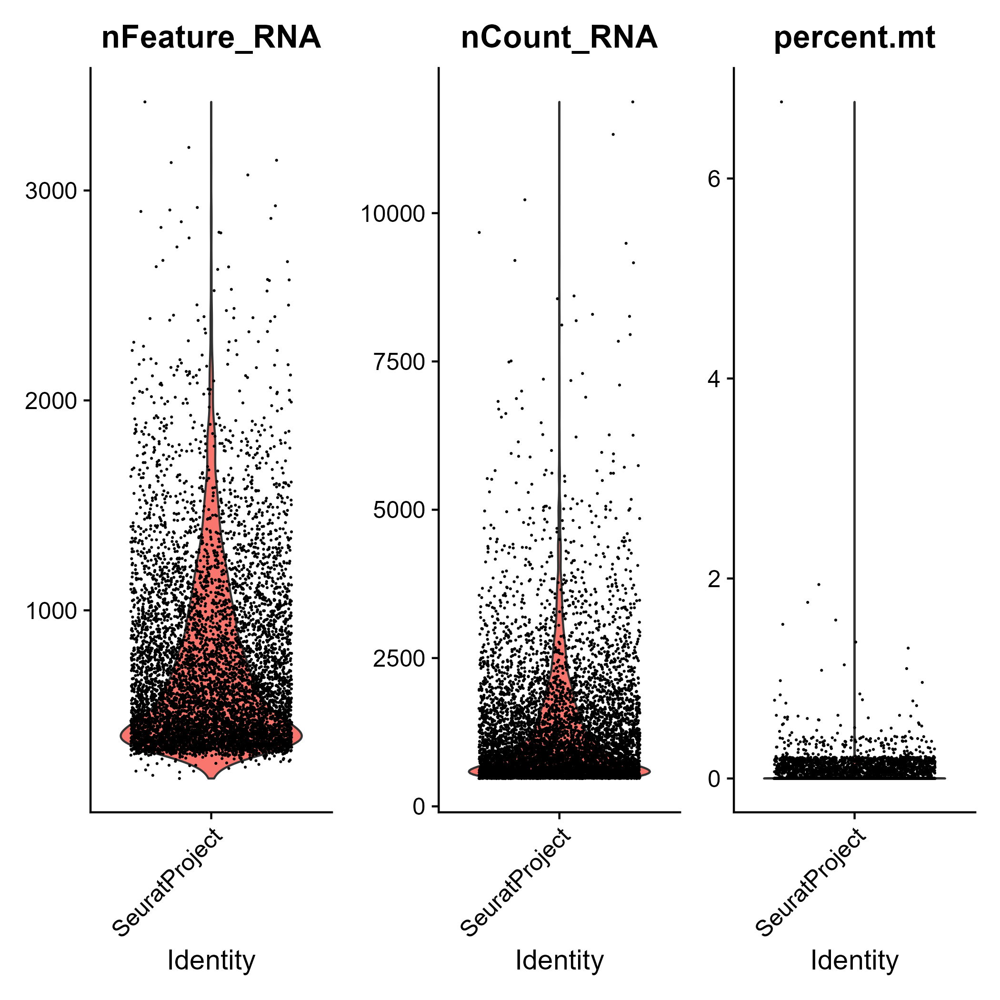
  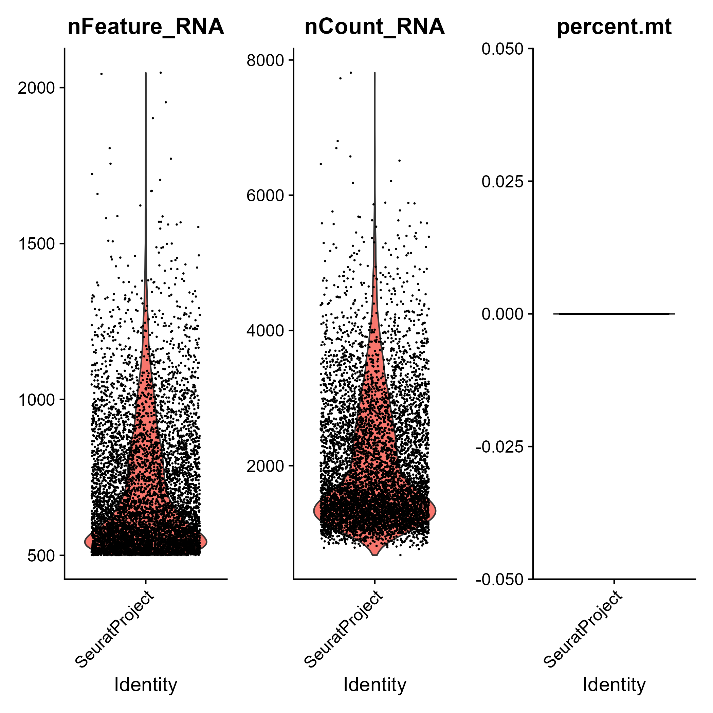
  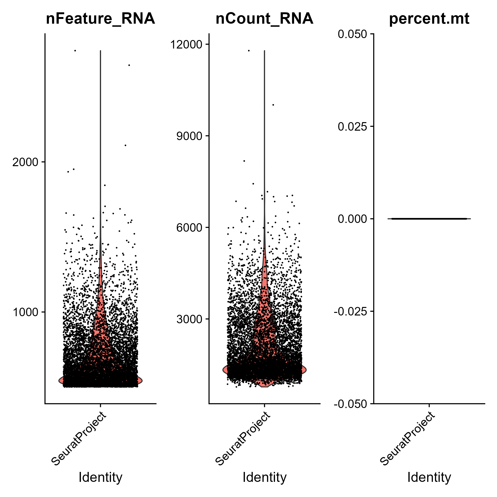
  
</p>

QC Metrics Visualized in the Violin Plot:

1. **Number of Detected Features (Genes) per Cell (nFeature_RNA)**:

    Purpose: This metric represents the number of unique genes detected in each cell.
    
    Interpretation: A violin plot for this metric helps identify cells with unusually low      or high gene detection. Outliers may indicate low-quality cells or potential cell          doublets.
    
2. **Total RNA Molecule Counts per Cell (nCount_RNA)**:

    Purpose: Indicates the total number of RNA molecules detected in each cell.
    
    Interpretation: Examining the distribution of RNA molecule counts helps identify cells     with unusually low or high total counts, which may be indicative of low-quality or         outlier cells.
    
3. **Percentage of Reads Mapping to Mitochondrial Genes (percent.mt)**:

    Purpose: Measures the percentage of RNA reads originating from mitochondrial genes.
    
    Interpretation: High percentages may suggest mitochondrial contamination, often            observed in low-quality or dying cells.
    
*Interpretation of the Violin Plot*:
The violin plot visually represents the distribution of each QC metric across all cells in the dataset. Each vertical violin corresponds to one metric, and the width of the violin at different points indicates the density of cells with specific metric values.

**nFeature_RNA Violin**: Check for outliers or asymmetry, which may indicate cells with aberrant gene detection.

**nCount_RNA Violin**: Assess the spread of total RNA molecule counts, identifying cells with extreme values.

**percent.mt Violin**: Examine the distribution of mitochondrial contamination percentages, identifying cells with potential issues.

<p float="left">
  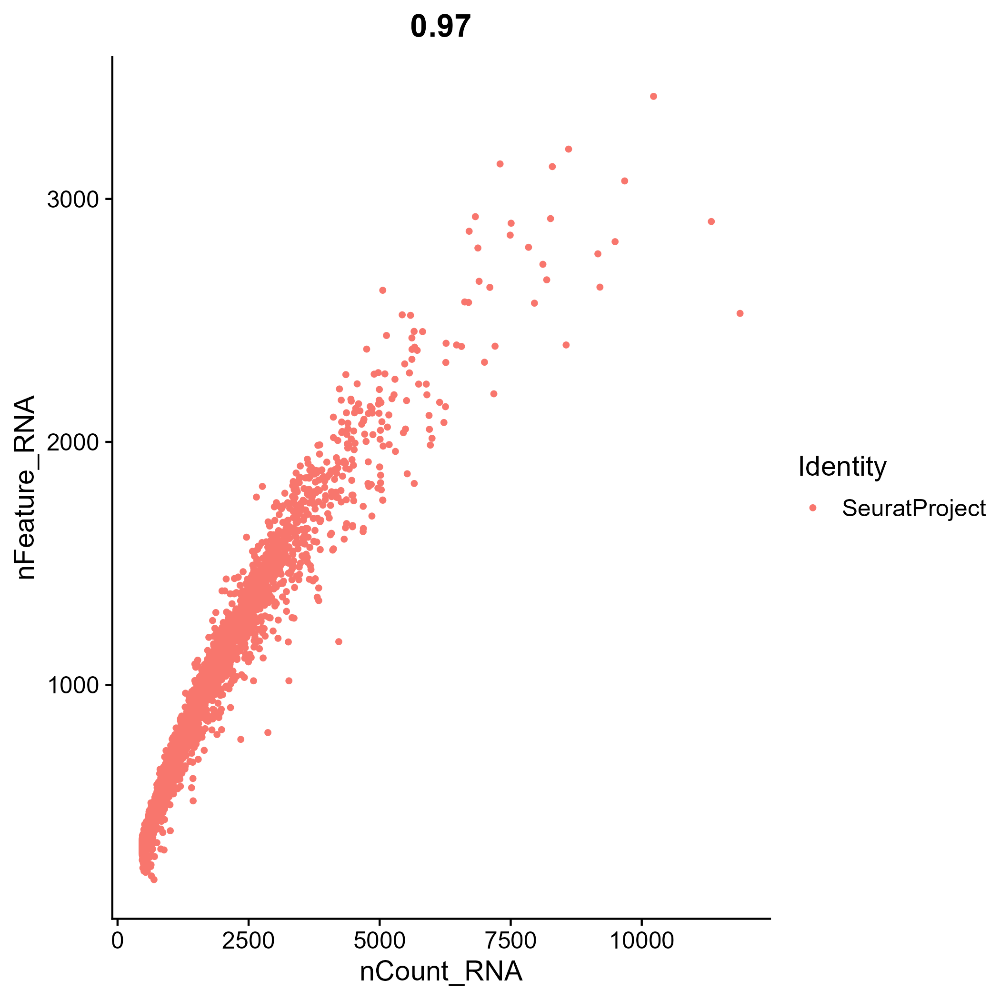
  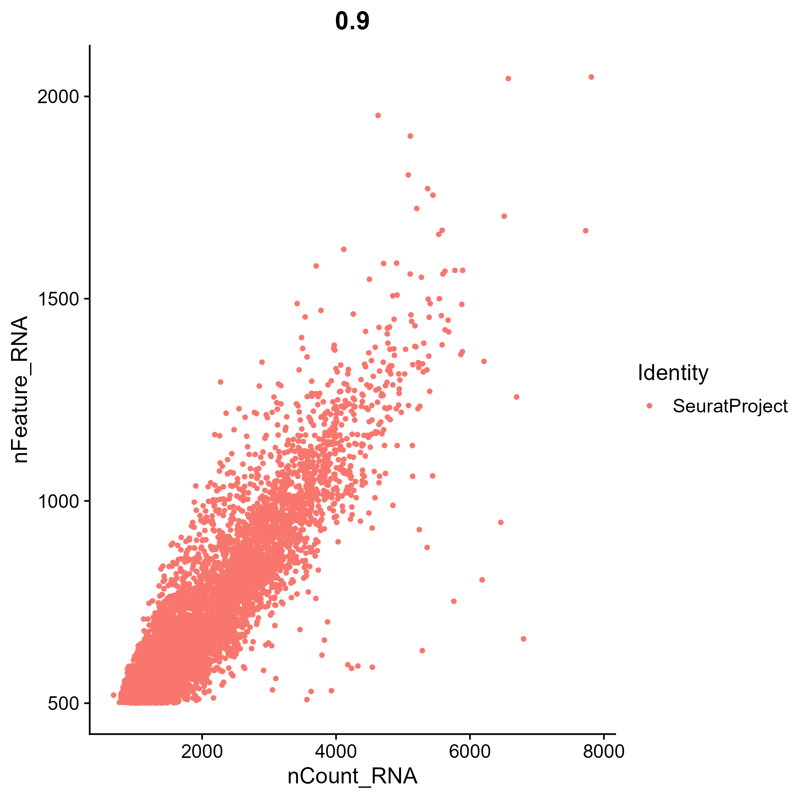
  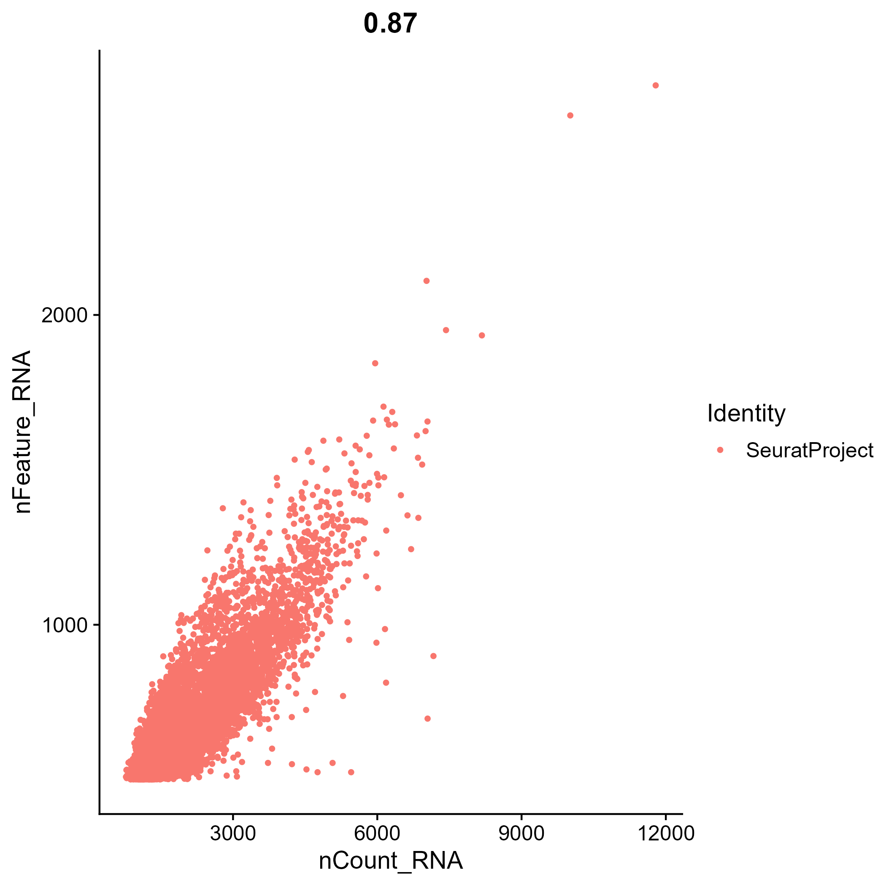
  
</p>

**Understanding the Plot**:

**X-Axis**: `nCount_RNA`

- **Definition:** Represents the total number of RNA molecules (UMIs) detected in each cell.

- **Interpretation:** Cells with higher values on the x-axis have a greater number of RNA molecules detected, indicating higher RNA content.

**Y-Axis**: `nFeature_RNA`

- **Definition:** Represents the number of unique genes detected in each cell.

- **Interpretation:** Cells with higher values on the y-axis have a greater diversity of genes expressed, indicating a higher complexity of transcriptional activity.

**Scatter Plot**:

- **Purpose:** The scatter plot visualizes the relationship between the two QC metrics (`nCount_RNA` and `nFeature_RNA`) for each cell in the dataset.

- **Interpretation:** 
  
  - Cells clustering towards the upper-right corner of the plot have both high RNA molecule counts (`nCount_RNA`) and a large number of detected unique genes (`nFeature_RNA`). These cells are typically considered of higher quality, exhibiting robust transcriptional activity.
  
  - Cells clustering towards the lower-left corner of the plot have lower RNA molecule counts and fewer detected unique genes, possibly indicating low-quality or empty cells.

**Conclusion**:
The scatter plot generated by the `FeatureScatter` function provides valuable insights into the distribution of two important QC metrics, `nCount_RNA` and `nFeature_RNA`, across the single-cell RNA-seq dataset. It enables researchers to identify and assess the quality of individual cells based on their RNA content and transcriptional complexity.

<p float="left">
  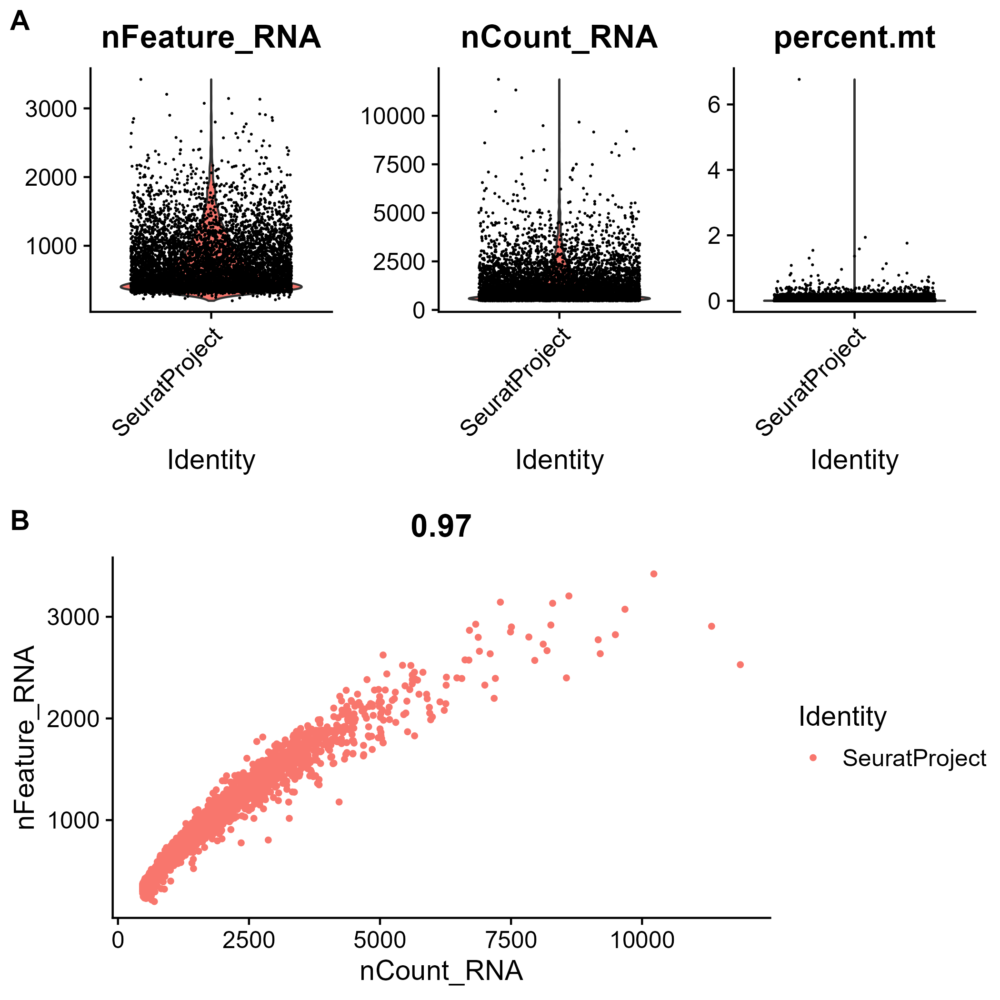
  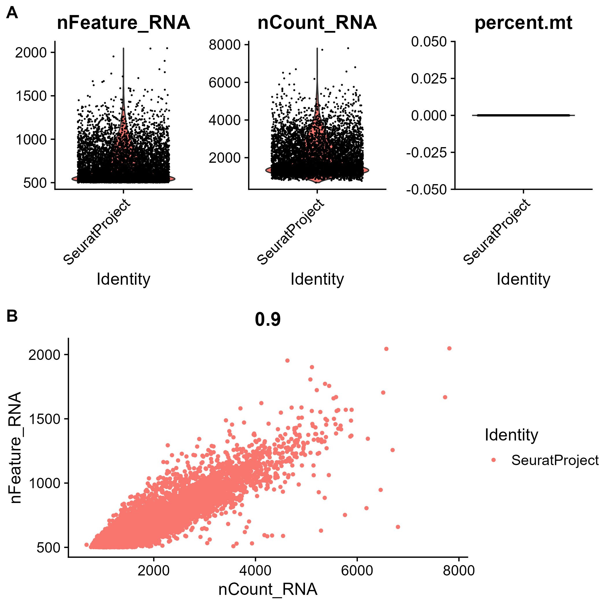
  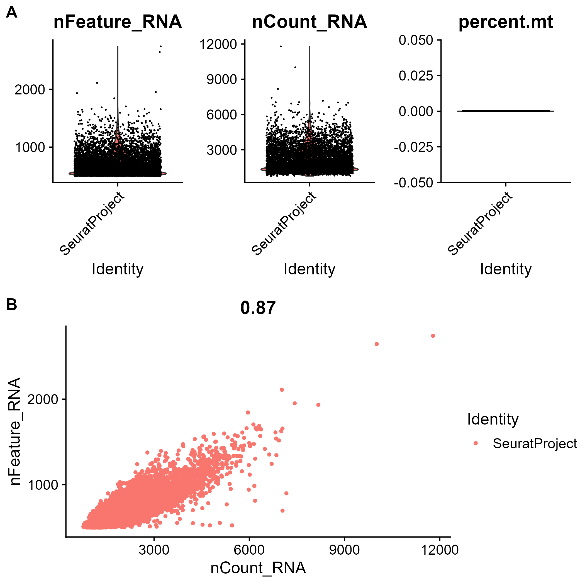
  
</p>
The above plot shows the joined distribution of the counts for each feature in the data and the violin plot for the distribution of the number of feature, number of counts and the mitochondria percentage present in the data.

- **Filtering:** Data filtering to ensure accurate downstream analysis by removing doublets.

```R
cellSight::filtering() The parameters for this function are the seurat object and the output destination. It filters and the data within a given range. 

```

The filtering function performs data subsetting in cellSight, filtering cells based on specified quality control (QC) criteria. Let's break down the conditions used for subsetting:

- `nFeature_RNA > min_rna`: Selects cells with a number of detected unique genes (`nFeature_RNA`) greater than a specified minimum threshold (`min_rna`).
- `nFeature_RNA < nfeature_rna`: Selects cells with a number of detected unique genes (`nFeature_RNA`) less than a specified maximum threshold (`nfeature_rna`).
- `nCount_RNA < ncount_rna`: Selects cells with a total number of RNA molecules (UMIs) (`nCount_RNA`) less than a specified maximum threshold (`ncount_rna`).
- `percent.mt < mit.percent`: Selects cells with a percentage of reads mapping to the mitochondrial genome (`percent.mt`) less than a specified threshold (`mit.percent`).

**Interpretation**:
This code is used to create a subset of cells from the original dataset based on specific QC metrics. The conditions specified in the subset are designed to filter out cells that may exhibit characteristics associated with low quality or potential contamination.

- **Filtered Cells:** The resulting subset includes cells that meet all the specified conditions, indicating they have a desirable range of unique gene counts, total RNA molecules, and mitochondrial contamination levels.

- **Downstream Analysis:** This subset of cells can then be used for downstream analyses, such as clustering, dimensionality reduction, or differential expression analysis, with increased confidence in the quality of the selected cells.

**Conclusion**:
Subsetting based on QC criteria is a crucial step in the analysis of single-cell RNA-seq data. This process allows researchers to focus on a subset of high-quality cells for further investigation and analysis, improving the accuracy and reliability of downstream results.

- **Normalization and Integration:** Normalization of the gene expression data and integration of the several datasets into one.
```R
cellSight::sctransform_integration()
```

The above function has two important tasks it undertakes. Firstly, the SCTransform function is used for performing variance stabilization and normalization on scRNA-seq count data. It applies a transformation to the input data matrix `x` to stabilize the variance across genes and normalize the data, making it suitable for downstream analysis. The function takes in scRNA-seq count data matrix as input to the function and returns a transformed and normalized expression matrix suitable for downstream analysis, such as clustering, dimensionality reduction, or differential expression analysis. The function aims to stabilize the variance across genes in scRNA-seq data, reducing the dependency of variance on mean expression levels. Additionally, the function performs normalization to account for differences in sequencing depth and library size across cells, ensuring that the expression values are comparable between cells.

The SCTransform function is typically applied as a preprocessing step in scRNA-seq analysis pipelines before performing downstream analyses. It helps improve the quality of the data and enhances the performance of subsequent analytical methods.

Secondly, the sctransfrom_integration() also is employed to integrate various datasets into one. The function typically needs to identify anchor points that serve as common reference points across datasets. After identifying the anchor genes the function utilizes the identified anchor sets to integrate the datasets. It aligns the datasets in a shared space, reducing batch effects and allowing for more accurate downstream analyses.

The integration is very useful in mitigating batch effects, enabling the combined analysis of datasets from different experimental conditions. The integrated dataset can be used for various downstream analyses, such as clustering, cell type identification, and differential expression analysis, as if it were a single, homogeneous dataset.

In summary, sctransfrom_integration() is a crucial step in the workflow when dealing with multiple single-cell RNA-seq datasets. It facilitates the creation of a normalized, harmonized, integrated dataset, allowing for robust and meaningful downstream analyses across heterogeneous experimental conditions.


- **Clustering:** Cell clustering based on gene expression profiles.
```R
cellSight::pca_clustering() The fnction expects 2 parameters. 1) The seurat object 2) The output path

```
We can leverage the significant Principal Components (PCs) obtained from the dimensionality reduction to identify cells with similar expression patterns through a graph-based clustering approach in cellSight. This approach involves embedding cells into a graph structure, typically using a K-nearest neighbor (KNN) graph, with edges connecting cells exhibiting similar gene expression patterns. The goal is to partition this graph into highly interconnected 'quasi-cliques' or 'communities.' For this purpose, we utilize the `FindClusters()` function. The `resolution` argument in this function, determining the granularity of clustering, needs optimization based on the experiment. Higher values result in more clusters. Typically, setting this parameter between 0.6-1.2 yields good results for single-cell datasets of around 3K cells.

<p float="left">
  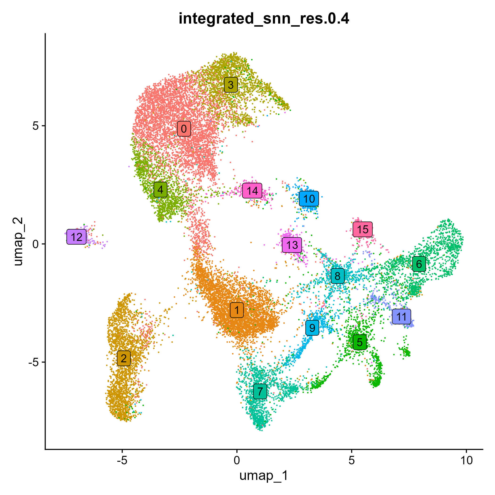
  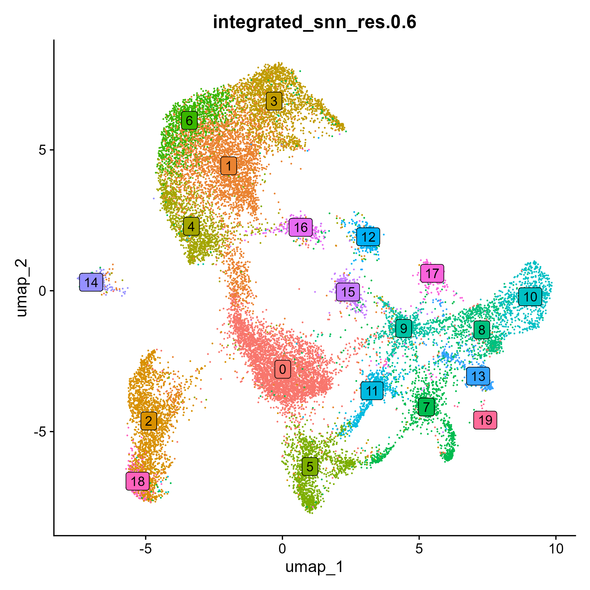
  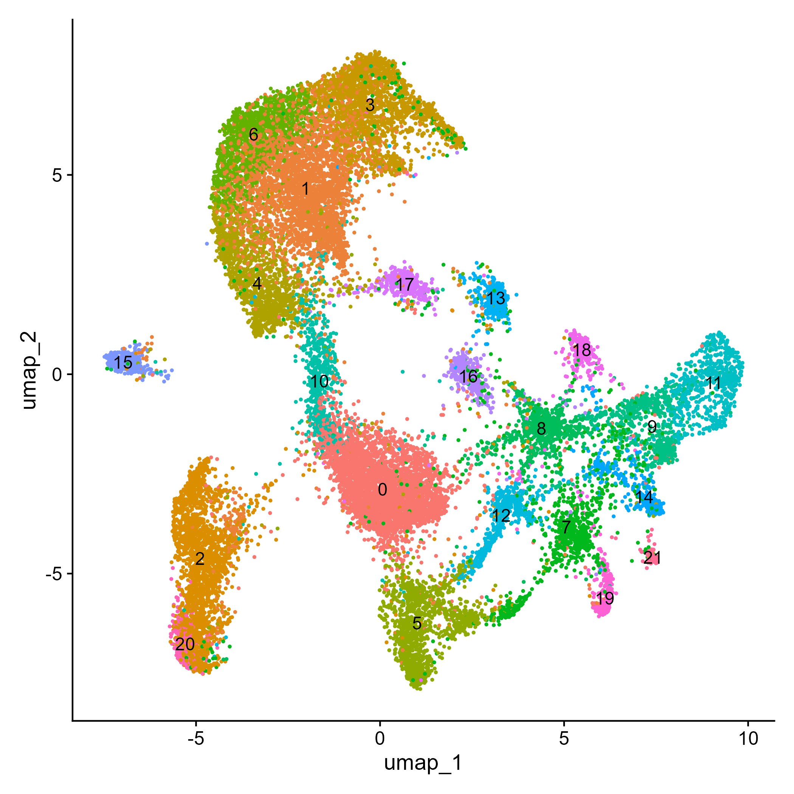
</p>


- **Differential Expression Analysis:** Identifying differentially expressed genes between clusters.
- **Visualization:** Visualize the results with various plots, including t-SNE, UMAP, and more.
- **Annotation:** Annotate cell clusters with known cell types or states.
- **Cell communication** Explore cell communication by inferring the possible Ligand-Receptor interactions.

## Example

<h2 id="injury">
Studying the dynamics of cells and gene expression during injury-induced skin regeneration
</h2>
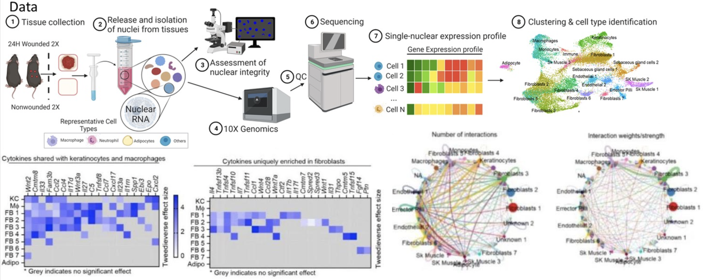

Effective tissue repair relies on precise orchestration of immune cell recruitment and activation at the injury site. Although the roles of tissue-resident immune cells and keratinocytes in initiating the skin's early immune response are well-established, our understanding of how various mesenchymal cell subsets contribute to the initial stages of injury-induced inflammation remains in its early stages. In our study design we collected tissue samples from 2 from naive/uninjured mice and 2 from injured mice. We ran the cellSight pipeline and found pivotal role of fibroblast for healing during injury. To follow along the detailed illustration of the steps please refer to the [RMarkdown](https://github.com/omicsEye/cellSight/wiki/Studying-the-dynamics-of-cells-and-gene-expression-during-injury%E2%80%90induced-skin-regeneration:) file.

<h2 id="aging">
Fibroblasts priming in aging
</h2>
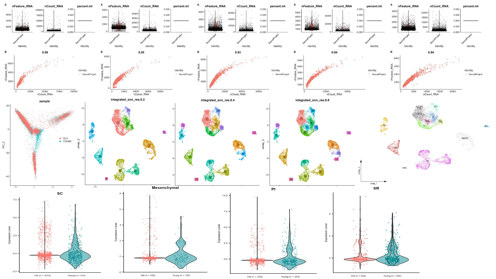

Despite the well-established importance of fibroblasts in human skin architecture and function, their heterogeneous nature has not yet been systematically analyzed. In the study conducted by [Solé-Boldo, Llorenç et al](https://www.nature.com/articles/s42003-020-0922-4), utilizing single-cell RNA sequencing, identifies four distinct fibroblast subpopulations in human skin and reveals their differential functions, including secretion, mesenchymal support, and inflammation. We observe a reduction in fibroblast heterogeneity and functional diversity with age, along with decreased interactions between fibroblasts and other skin cells, potentially contributing to skin aging.
To follow along the detailed illustration of the steps please refer to the [RMarkdown](https://github.com/omicsEye/cellSight/wiki/Detailed-outline-to-use-the-individual-function-of-cellSight-on-available-data:) file.

## Contributing

We welcome contributions from the community. If you'd like to contribute to cellSight, please follow our [Contributing Guidelines](CONTRIBUTING.md).

---

Thank you for choosing cellSight for your scRNA-seq analysis. We hope this tool simplifies your research and helps you gain valuable insights from your single-cell data. If you have any questions, encounter issues, or want to contribute, please don't hesitate to get in touch with us.

For updates and news, follow us on Twitter [@RahnavardLab](https://twitter.com/RahnavardLab). Happy analyzing!
